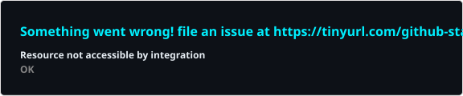

  

  <h3>AI / Data Engineer Intern @ BkFintech Institute | IT Student @ NEU</h3>

   
  

    
  

---

### About Me

* **Current Focus:** Building **Time-Series ML models**, **ETL Pipelines**, and **RAG-based AI applications**.
* **Learning Next:** Advanced **MLOps**, **Distributed Data Processing**, and **Cloud Architecture**.
* **Collaborations:** Open to discussions on **AI/ML Solutions**, **Data Engineering**, and **Fintech Innovations**.

 

### Connect with Me

  
  
  

  

---

### Tech Universe

**Frontend**

  
  

**Backend**

  
  
  
  

**AI / ML**

  
  

**Database**

  
  
  

**Tools**

  
  
  

---

### GitHub Activity Graph

  

---

### GitHub Analytics

  
  

---

### Fun Fact: Commit Snake

  <picture>
    <source media="(prefers-color-scheme: dark)" srcset="./profile/github-contribution-grid-snake-dark.svg"/>
    <source media="(prefers-color-scheme: light)" srcset="./profile/github-contribution-grid-snake.svg"/>
    
  </picture>

  

